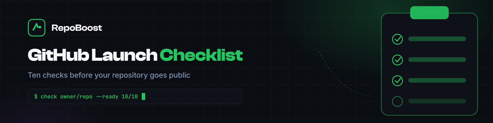

<p align="center">
  <a href="https://buygithub.com/?utm_source=github&utm_medium=readme&utm_campaign=github-launch-checklist"></a>
</p>

<p align="center">
  <a href="https://readme-typing-svg.demolab.com?font=Inter&weight=600&size=22&duration=3000&pause=1500&color=22C55E&center=true&vCenter=true&width=600&lines=Ten+checks+before+launch;See+it+before+your+users+do;Free+and+open+source"></a>
</p>

<p align="center">
  
  
  <a href="https://github.com/marketplace/actions/github-launch-checklist"></a>
  
  
  
</p>

# GitHub Launch Checklist

A repository's first hour decides its fate. Visitors judge the name, the description, the README and the topics before they read a single line of code. This tool audits a GitHub repository **before launch** and scores ten readiness signals 0-10, so you see what your first users will see - while you can still fix it.

```console
$ github-launch-checklist repoboost-hq/buy-github-stars

GitHub Launch Readiness
────────────────────────

Repository name      ✓ descriptive and searchable
Description          ✓ present and well sized
Topics               ✓ 8 topics
README               ✓ 743 words
License              ✓ MIT
Demo                 ✓ homepage set
Installation         ✓ installation or quick start found
Contributing guide   ✓ guide present
Issue templates      ✓ templates present
Social preview       ⚠ check manually in repo Settings

Launch readiness: 9.5/10
```

## ✨ What it checks

| Check | What "ready" means |
|---|---|
| Repository name | Descriptive, searchable, not generic |
| Description | Present, 20-300 characters, keyword front-loaded |
| Topics | At least 5 relevant topics set |
| README | 300+ words with real content |
| License | A license file exists |
| Demo | A homepage or demo link is set |
| Installation | An install or quick start section exists |
| Contributing guide | CONTRIBUTING.md is present |
| Issue templates | `.github/ISSUE_TEMPLATE` is configured |
| Social preview | Checked manually (GitHub's API does not expose it) |

Every check is explained in [docs/checks.md](docs/checks.md) - including **why it matters and how to fix a fail**.

## 🚀 Quick start

```bash
pip install git+https://github.com/repoboost-hq/github-launch-checklist.git

github-launch-checklist owner/repo
```

Or run it without installing:

```bash
python checklist.py owner/repo
```

## ⚙️ Options

```bash
github-launch-checklist owner/repo            # readiness report
github-launch-checklist owner/repo --json     # machine-readable output
github-launch-checklist owner/repo --strict   # exit 1 if readiness < 8/10
--token $GITHUB_TOKEN                          # optional, raises API rate limit
```

Works on any public repository. No token required for occasional use.

## 🤖 Use as a GitHub Action

Available on the [GitHub Marketplace](https://github.com/marketplace/actions/github-launch-checklist) - add it to any workflow in one step.

```yaml
- uses: repoboost-hq/github-launch-checklist@v1
  with:
    repo: owner/repo     # optional - defaults to the calling repository
    fail-under: 8        # optional - fails the step below this score
```

## 🐳 Docker

```bash
docker run --rm ghcr.io/repoboost-hq/github-launch-checklist owner/repo
```

## 🧠 Why these ten checks

GitHub search weighs a repository's name, description, topics, README and engagement together. Most repositories fail their first impression not because of the code, but because the name is vague, the About line is empty, the topics are missing or the README never explains how to install anything.

This checklist is the pre-flight version of that reality: fix the ten things above and the repository is discoverable, credible and easy to adopt from day one.

- [Why is my repo not showing in GitHub search?](docs/checks.md#faq) - the short answer: an empty description or missing topics.
- Ranking your repository for keywords after launch is a different job - that is what a [GitHub search ranking service](https://buygithub.com/github-search-ranking/?utm_source=github&utm_medium=readme&utm_campaign=github-launch-checklist) is for.

## ❓ FAQ

**Is it free?**
Yes - MIT licensed, open source, no sign-up, no limits beyond GitHub's API rate limits.

**Do I need a token?**
No. A token only raises the rate limit if you audit many repositories in a row.

**Why does it want at least 5 topics?**
Topics are how GitHub search filters discover repositories. Under 5 topics, you are invisible in most filtered searches. 5-10 relevant topics is the sweet spot.

**Is the social preview automated?**
No - GitHub's API does not expose it, so the tool flags it as a manual check. Set it in repository Settings.

**Can I use it in CI?**
Yes: `--strict` exits non-zero below 8/10, so a workflow step fails when a repository regresses.

**It says I am not ready - what do I fix first?**
The fails in order: description, installation section, topics, license. Those four move the needle most.

## 🔗 Related

- [github-ranking-audit](https://github.com/nMaas8388/github-ranking-audit) - scores a repo's GitHub search ranking signals
- [github-stars-history](https://github.com/Marcos66236/github-stars-history) - track star velocity over time

More from the org: [github.com/repoboost-hq](https://github.com/repoboost-hq)

---

<p align="center">
  <b><a href="https://buygithub.com/?utm_source=github&utm_medium=readme&utm_campaign=github-launch-checklist">🌐 buygithub.com</a></b> &nbsp;|&nbsp;
  <a href="https://github.com/repoboost-hq">🧰 More from the org</a>
</p>
<p align="center"><sub>Built by RepoBoost. Independent service, not affiliated with GitHub, Inc.</sub></p>
